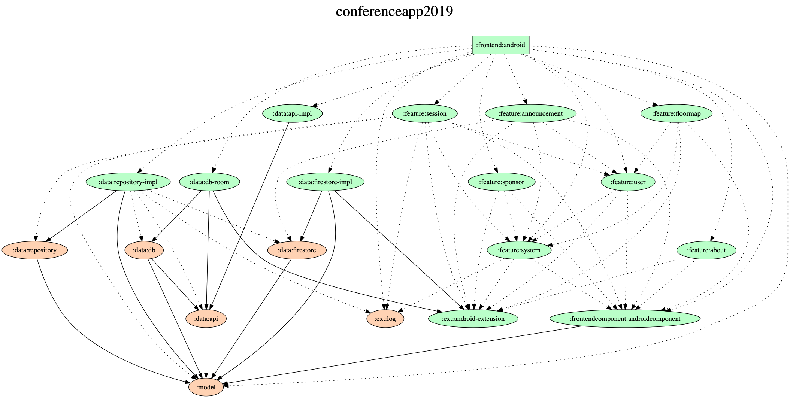

# DroidKaigi 2019 official Android app[WIP]

[DroidKaigi 2019](https://droidkaigi.jp/2019/en/) is a conference tailored for developers on 8th and 9th February 2019.

[](https://dply.me/b9riom#install)


# Features

| top | filter |
|---|---|
|  |  |

* View conference schedule and details of each session
* Set notification for upcoming sessions on your preference
* Search sessions and speakers and topics
* Show Information Feed

# Contributing
We are always welcome your contribution!

## How to find the tasks
We use [waffle.io](https://waffle.io/DroidKaigi/conference-app-2019) to manage the tasks.
Please find the issues you'd like to contribute in it.
[welcome contribute](https://github.com/DroidKaigi/conference-app-2019/labels/welcome%20contribute) and [easy](https://github.com/DroidKaigi/conference-app-2019/labels/easy) are good for first contribution.

Of course, it would be great to send PullRequest which has no issue!

## How to contribute
If you find the tasks you want to contribute, please comment in the issue like [this](https://github.com/DroidKaigi/conference-app-2018/issues/73#issuecomment-357410022) to prevent to conflict contribution.
We'll reply as soon as possible, but it's unnecessary to wait for our reaction. It's okay to start contribution and send PullRequest!

We've designated these issues as good candidates for easy contribution. You can always fork the repository and send a pull request (on a branch other than `master`).

# Development Environment

## Unidirectional data flow(Flux-based) Architecture

Unidirectional data flow(Flux-based) Architecture with `Kotlin Coroutines` and `AndroidX` Libraries(`LiveData`, `ViewModel`, `Room`) `DataBinding`, `Dagger` and `AssistedInejct`, `Firebase` etc.


## Groupie

By using `Groupie` you can simplify the implementation around RecyclerView.

```
class SpeakerItem @AssistedInject constructor(
    @Assisted val speaker: Speaker, // Inject by AssistedInject
    val navController: NavController // Inject by Dagger
) : BindableItem<ItemSpeakerBinding>() {
    @AssistedInject.Factory
    interface Factory {
        fun create(
            speaker: Speaker
        ): SpeakerItem
    }

    override fun getLayout(): Int = R.layout.item_speaker

    override fun bind(itemBinding: ItemSpeakerBinding, position: Int) {
        itemBinding.speakerText.text = speaker.name
        ...
        
        itemBinding.speakerText.setOnClickListener {
            navController.navigate(
                SessionDetailFragmentDirections.actionSessionDetailToSpeaker(
                    speaker.id
                )
            )
        }
    }
}
```

We use `AssistedInject` for creating item.

```
    @Inject lateinit var speakerItemFactory: SpeakerItem.Factory
    
...
        val speakerItems = session
            .speakers
            .map { speakerItemFactory.create(it) }
        groupAdapter.update(speakerItems)
```

## Multi Module Project

### Module conceptual diagram


### Generated diagram

Green: Android Module  
Orange: Common Module

Dashed line: implementation  
Normal line: api



# Architecture

Unidirectional data flow(Flux-based) Architecture with Kotlin Coroutines and AndroidX Libraries(LiveData, ViewModel, Room) DataBinding, dependency injection, Firebase etc.


## Activity/Fragment -> Action Creator


Fragments just call Action Creator's method.

```kotlin
class SessionPagesFragment : DaggerFragment() {
    @Inject lateinit var announcementActionCreator: AnnouncementActionCreator
    override fun onActivityCreated(savedInstanceState: Bundle?) {
    ...
        announcementActionCreator.load()
    }
```

## Action Creator <-> DB / API and Action Creator -> dispatcher


Action Creator fetches data from DB / API with `Kotlin Coroutines suspend function`. And Action Creator dispatches data loaded action and loading state changed actions. 

```kotlin
class AnnouncementActionCreator @Inject constructor(
    override val dispatcher: Dispatcher,
    val fireStore: FireStore,
    @PageScope val lifecycle: Lifecycle
) : CoroutineScope by lifecycle.coroutineScope,
    ErrorHandler {

    fun load() = launch {
        try {
            dispatcher.dispatch(Action.AnnouncementLoadingStateChanged(LoadingState.LOADING))
            // fetch announcement by Kotlin Coroutines suspend function
            dispatcher.dispatch(Action.AnnouncementLoaded(fireStore.getAnnouncements()))
            dispatcher.dispatch(Action.AnnouncementLoadingStateChanged(LoadingState.LOADED))
        } catch (e: Exception) {
            onError(e)
            dispatcher.dispatch(Action.AnnouncementLoadingStateChanged(LoadingState.INITIALIZED))
        }
    }
}
```

Actions are just data holder class.

```kotlin
sealed class Action {
...
    class AnnouncementLoadingStateChanged(val loadingState: LoadingState) : Action()
    class AnnouncementLoaded(val announcements: List<Announcement>) : Action()
...
}
```

## Dispatcher -> Store


Store subscribe dispatcher's action with `Kotlin Coroutines channel` and transform it to AndroidX `LiveData`.
This store is a `ViewModel`. But if the store is used by the whole application(ex: UserStore), you can change the store to a singleton.

```kotlin
class AnnouncementStore @Inject constructor(
    dispatcher: Dispatcher
) : ViewModel() {
    val loadingState: LiveData<LoadingState> = dispatcher
        .subscribe<Action.AnnouncementLoadingStateChanged>()
        .map { it.loadingState }
        .toLiveData(LoadingState.LOADING)
    val announcements: LiveData<List<Announcement>> = dispatcher
        .subscribe<Action.AnnouncementLoaded>()
        .map { it.announcements }
        .toLiveData(listOf())
}
```

## Store -> Activity/Fragment


In the fragment, we can observe Store's `LiveData`. You can display the UI with `LiveData`.

```kotlin
    override fun onActivityCreated(savedInstanceState: Bundle?) {
...
        announcementStore.loadingState.changed(viewLifecycleOwner) {
            // apply loading state for progress bar
            progressTimeLatch.loading = it == LoadingState.LOADING
        }
        announcementStore.announcements.changed(viewLifecycleOwner) { announcements ->
            // we can show UI with announcements
        }
...
```

## Thanks
Thank you for contributing!

* Contributors
  * [GitHub : Contributors](https://github.com/DroidKaigi/conference-app-2019/graphs/contributors)
* Designer  
  * TBW

## Credit
This project uses some modern Android libraries and source codes.

* AndroidX Libraries
* TBW
